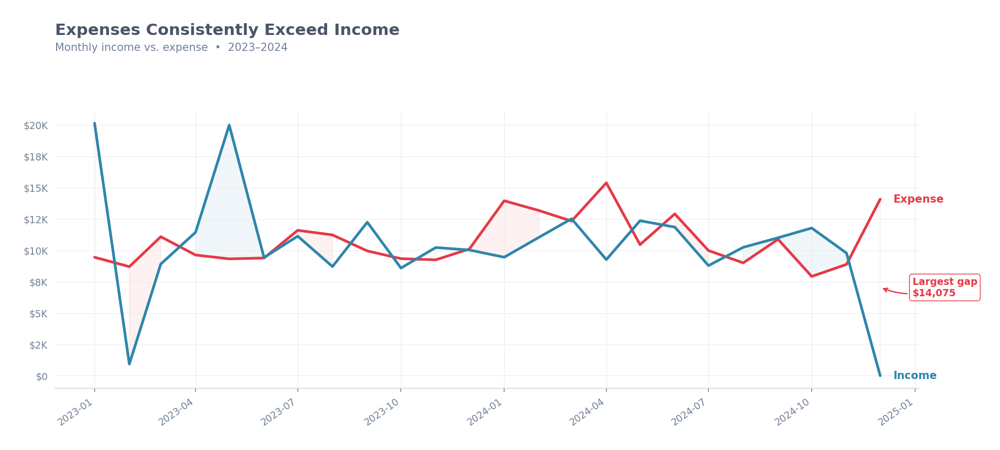
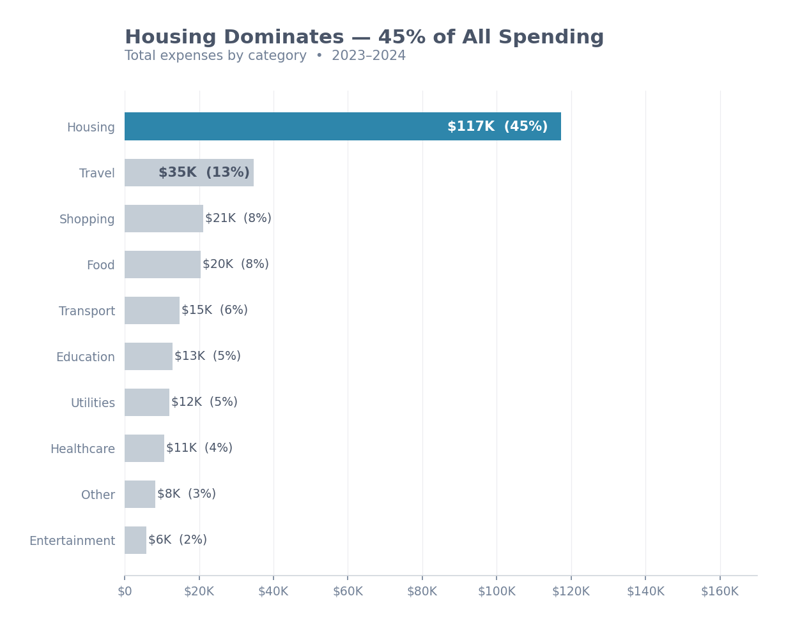
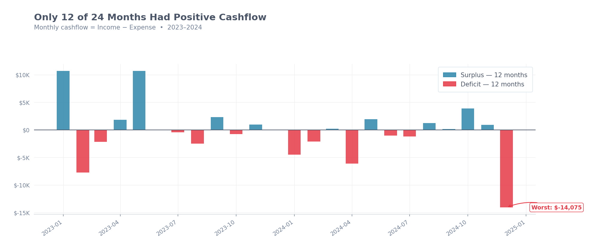
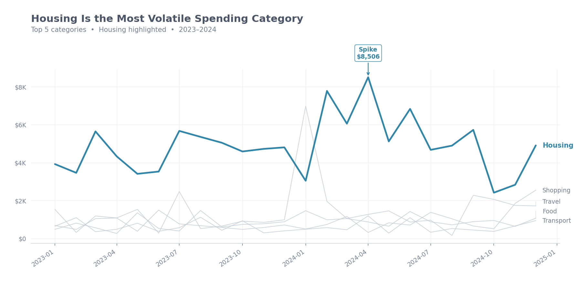
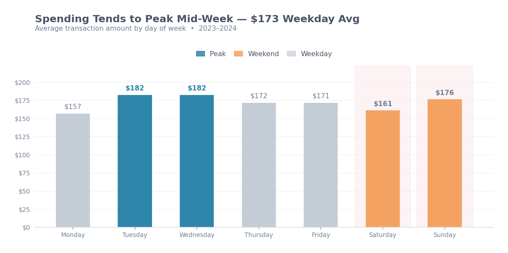

# 📊 Personal Finance Data Analysis

> An end-to-end data analysis pipeline for personal finance data — from raw CSV to a professional HTML report with charts, insights, and monthly summaries.

---

## 🔍 Overview

This project demonstrates a complete data analyst workflow:

1. **Smart Format Detection** — auto-detect and map any CSV format from any source
2. **Data Cleaning** — handle missing values, duplicates, outliers, and type fixes
3. **Exploratory Data Analysis** — trends, category breakdowns, cashflow analysis
4. **Visualization** — 5 professional charts (PNG)
5. **Client Report** — self-contained HTML report with embedded charts and tables

**Use case:** A freelance data analyst receives a client's raw finance CSV (in any format) and delivers a clean dataset + professional report as the final deliverable.

---

## 📈 Sample Output

> Charts generated automatically from the sample dataset included in this repo.

### Monthly Income vs Expense


### Spending by Category


### Monthly Cashflow


### Top Category Trends


### Spending by Day of Week


---

## 📁 Project Structure

```
finance_analysis/
│
├── scripts/
│   ├── 00_format_mapper.py       # Auto-detect & map any CSV format to standard
│   ├── 01_data_cleaning.py       # Clean & validate raw data
│   ├── 02_eda_visualization.py   # EDA & chart generation
│   ├── 03_report_generator.py    # HTML report generator
│   └── generate_dataset.py       # Generate sample dataset (for demo/testing)
│
├── sample/                       # Sample data & charts for preview
│   ├── sample_data.csv           # 50-row sample dataset
│   ├── 01_monthly_trend.png
│   ├── 02_spending_by_category.png
│   ├── 03_monthly_cashflow.png
│   ├── 04_category_trend.png
│   └── 05_day_of_week.png
│
├── data/
│   ├── raw/                      # Raw input data (not committed to Git)
│   ├── cleaned/                  # Cleaned output + cleaning log
│   └── output/                   # EDA summary CSV
│
├── assets/                       # Generated charts (PNG)
├── reports/                      # Final HTML report for client
│
├── run_all.py                    # Run full pipeline in one command
├── requirements.txt              # Python dependencies
├── .gitignore                    # Git ignore rules
└── README.md                     # This file
```

---

## ⚙️ Setup

### Prerequisites
- Python 3.9 or higher
- pip

### 1. Clone the repository
```bash
git clone https://github.com/armin-lee/finance-analysis.git
cd finance-analysis
```

### 2. Create virtual environment
```bash
python -m venv venv
```

### 3. Activate virtual environment

**Windows:**
```bash
venv\Scripts\activate
```

**macOS / Linux:**
```bash
source venv/bin/activate
```

### 4. Install dependencies
```bash
pip install -r requirements.txt
```

---

## 🚀 Usage

### Option A — Demo with sample data
```bash
python run_all.py
```
Generates a complete analysis using synthetic sample data.

### Option B — Use your own client data (any CSV format)
```bash
python run_all.py --client-data
```
Automatically detects your CSV format, maps columns, and runs the full pipeline.

### Option C — Skip to analysis (data already in standard format)
```bash
python run_all.py --skip-gen
```

### Option D — Run scripts individually
```bash
python scripts/00_format_mapper.py     # Step 0: Map client CSV to standard format
python scripts/01_data_cleaning.py     # Step 1: Clean & validate
python scripts/02_eda_visualization.py # Step 2: Generate charts
python scripts/03_report_generator.py  # Step 3: Generate HTML report
```

---

## 📥 Using Client Data (Any Format)

The `00_format_mapper.py` script automatically handles CSV files from any source — no manual reformatting needed.

### How it works
1. Place the client's CSV file in `data/raw/` (any filename)
2. Run `python run_all.py --client-data`
3. The mapper auto-detects format and converts to standard → pipeline runs automatically

### Supported input formats

**Column names** — automatically mapped from any of these variants:

| Standard Column | Accepted Variants |
|-----------------|-------------------|
| `date` | date, tanggal, transaction date, posting date, waktu, timestamp... |
| `amount` | amount, jumlah, nominal, value, total, debit, harga, biaya... |
| `category` | category, kategori, type, jenis, spending category, tag... |
| `description` | description, deskripsi, narration, merchant, payee, keterangan... |
| `type` | type, tipe, debit/credit, income/expense, in/out... |
| `payment_method` | payment method, channel, payment channel, metode, wallet... |
| `notes` | notes, remarks, memo, comment, keterangan... |

**Date formats** — 13 formats supported:

| Format | Example |
|--------|---------|
| YYYY-MM-DD | 2024-03-15 |
| DD/MM/YYYY | 15/03/2024 |
| MM/DD/YYYY | 03/15/2024 |
| DD-MM-YYYY | 15-03-2024 |
| DD MMM YYYY | 15 Mar 2024 |
| YYYYMMDD | 20240315 |
| DD.MM.YYYY | 15.03.2024 |

**Currency & amount** — auto-cleaned:
- Symbols removed: `$`, `€`, `£`, `¥`, `Rp`, `IDR`, `USD`, `EUR`
- Thousand separators: both `1,000.50` (US) and `1.000,50` (EU) formats
- Negative values: both `-100` and `(100)` formats

**Separators** — auto-detected: comma (`,`), semicolon (`;`), tab (`\t`)

**Missing columns** — graceful fallbacks:
- No `type` column → inferred from amount sign (negative = Expense)
- No `category` → defaults to "Other"
- No `payment_method` → defaults to "Unknown"
- Extra columns → safely ignored

---

## 📊 Sample Dataset

A 50-row sample dataset is included in `sample/sample_data.csv` for testing and demonstration.

| Column | Description |
|--------|-------------|
| date | Transaction date (YYYY-MM-DD) |
| category | Spending category (Food, Housing, Transport, etc.) |
| description | Transaction description |
| amount | Transaction amount (USD) |
| type | Expense or Income |
| payment_method | Payment method used |

Try it:
```bash
# Copy sample data to raw folder and run pipeline
copy sample\sample_data.csv data\raw\personal_finance_raw.csv
python run_all.py --skip-gen
```

---

## 🛠️ Tech Stack

| Tool | Purpose |
|------|---------|
| Python 3.9+ | Core language |
| pandas | Data manipulation & cleaning |
| matplotlib | Chart generation |
| seaborn | Enhanced visualizations |
| openpyxl | Excel file support |

---

## 📋 Pipeline Steps

### Step 0 — Format Mapper (`00_format_mapper.py`)
- Auto-detect CSV separator
- Map column names from any language/format to standard
- Parse 13 date format variants
- Clean currency symbols and thousand separators
- Infer income/expense from amount sign if type column missing
- Generate mapping log

### Step 1 — Data Cleaning (`01_data_cleaning.py`)
- Fix data types (date → datetime, amount → float)
- Fill missing values (description, payment_method → "Unknown")
- Remove duplicate rows
- Validate amount values (remove ≤ 0)
- Flag statistical outliers (> mean + 3×std per category)
- Add derived columns (month_name, week, day_of_week)
- Generate cleaning log with full audit trail

### Step 2 — EDA & Visualization (`02_eda_visualization.py`)
- Generate 5 professional charts
- Compute key financial metrics
- Export EDA summary CSV

### Step 3 — Report Generator (`03_report_generator.py`)
- Build self-contained HTML report
- Embed all charts as base64
- Include KPI cards, category table, monthly summary table

---

## ⚠️ Known Limitations

- Report is HTML-based — to get PDF, use browser's Print → Save as PDF
- Dataset generator uses synthetic data for demo purposes only
- Format mapper works best with structured tabular CSV — not bank statement PDFs

---

## 📄 License

MIT License — free to use and modify for personal or commercial projects.

---

## 👤 Author

Built as a portfolio project for freelance data analytics services.
For inquiries, reach out via [Fiverr](https://www.fiverr.com/arminlee/analyze-financial-data-and-create-clear-reports-and-dashboards) or [LinkedIn](https://www.linkedin.com/in/armin-lee/).
